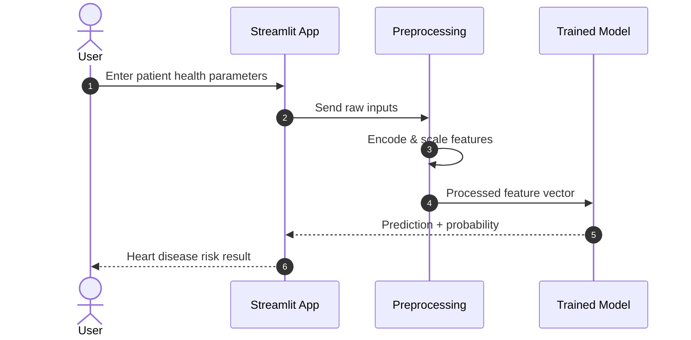

<div align="center">


<a href="https://github.com/your-username/heart-disease-prediction">
  
</a>

<br/><br/>

**AI-Powered Heart Disease Risk Prediction Using Machine Learning**

A end-to-end machine learning application that estimates the likelihood of heart disease from patient health parameters, supporting early risk identification and data-driven healthcare decisions.

<br/>

[](https://www.python.org)
[](https://scikit-learn.org)
[](https://xgboost.readthedocs.io)
[](https://streamlit.io)
[](https://jupyter.org)
[](LICENSE)

[](https://pandas.pydata.org)
[](https://numpy.org)
[](https://matplotlib.org)
[](https://seaborn.pydata.org)
[](#)
[](#-contributing)

<br/>

[🚀 **Live Demo**](https://your-app-name.streamlit.app) &nbsp;·&nbsp; [📓 **Notebooks**](notebooks/) &nbsp;·&nbsp; [🐛 **Report Bug**](https://github.com/your-username/heart-disease-prediction/issues/new?labels=bug) &nbsp;·&nbsp; [💡 **Request Feature**](https://github.com/your-username/heart-disease-prediction/issues/new?labels=enhancement)

</div>

---

## 📑 Table of Contents

- [🩺 Project Overview](#-project-overview)
- [🎯 Objectives](#-objectives)
- [❗ Problem Statement](#-problem-statement)
- [📊 Dataset Information](#-dataset-information)
- [🔬 Machine Learning Pipeline](#-machine-learning-pipeline)
- [🏗️ Workflow Architecture](#️-workflow-architecture)
- [🤖 Models Used](#-models-used)
- [📈 Model Comparison](#-model-comparison)
- [🎯 Performance Metrics](#-performance-metrics)
- [📸 Screenshots](#-screenshots)
- [🧰 Tech Stack](#-tech-stack)
- [⚡ Installation Guide](#-installation-guide)
- [🚀 Usage](#-usage)
- [📁 Project Structure](#-project-structure)
- [🔮 Future Improvements](#-future-improvements)
- [🤝 Contributing](#-contributing)
- [❓ FAQ](#-faq)
- [📜 License](#-license)

---

## 🩺 Project Overview

**Heart Disease Prediction System** is a machine learning application that predicts the likelihood of heart disease based on patient health parameters such as age, blood pressure, cholesterol, ECG results, and exercise-related indicators.

The project walks through the **complete ML lifecycle**, from raw data to a deployed, interactive web app, and compares six classification algorithms to identify the most reliable model for risk prediction.

<div align="center">

| 🫀 **Risk Prediction** | 📊 **Data Insights** | 🤖 **6 ML Models** | 🌐 **Web App** |
|:---:|:---:|:---:|:---:|
| Instant probability-based output | EDA with rich visualizations | Compared on multiple metrics | Interactive Streamlit interface |

</div>

> ⚠️ **Disclaimer:** This project is built for educational and research purposes. It is **not a medical device** and must not replace professional medical diagnosis or advice.

---

## 🎯 Objectives

| # | Objective | Description |
|:---:|:---|:---|
| 1️⃣ | **Predict heart disease risk accurately** | Train and tune models to maximize predictive performance |
| 2️⃣ | **Assist in early diagnosis** | Highlight high-risk patterns before symptoms become severe |
| 3️⃣ | **Improve healthcare decision-making** | Provide data-driven, interpretable insights |
| 4️⃣ | **Demonstrate practical ML implementation** | Showcase a complete, reproducible ML workflow |

---

## ❗ Problem Statement

Cardiovascular diseases are among the **leading causes of death worldwide**. Early detection is critical, yet traditional diagnosis can be time-consuming, costly, and dependent on specialist availability.

This project explores how **machine learning can analyze routine clinical measurements** to estimate heart disease risk quickly, helping healthcare professionals prioritize patients and helping individuals become more aware of potential risk factors.

> **Core question:** *Given a patient's clinical parameters, can we reliably predict whether they are at risk of heart disease?*

---

## 📊 Dataset Information

<details open>
<summary><b>🗂️ Dataset Overview</b></summary>
<br/>

| Property | Details |
|:---|:---|
| **Source** | UCI Heart Disease / Kaggle Heart Disease dataset *(update to your exact source)* |
| **Task** | Binary classification (Heart Disease: `1` = Yes, `0` = No) |
| **Records** | *Add number of rows* |
| **Features** | *Add number of features* |
| **Target Variable** | `HeartDisease` |

</details>

<details open>
<summary><b>🧬 Feature Description</b></summary>
<br/>

| Feature | Description | Type |
|:---|:---|:---:|
| 🎂 **Age** | Age of the patient in years | Numerical |
| 🚻 **Sex** | Gender of the patient | Categorical |
| 💔 **Chest Pain Type** | Type of chest pain (e.g., typical angina, atypical angina, non-anginal, asymptomatic) | Categorical |
| 🩸 **Resting Blood Pressure** | Resting blood pressure (mm Hg) | Numerical |
| 🧪 **Cholesterol** | Serum cholesterol (mg/dl) | Numerical |
| 🍬 **Fasting Blood Sugar** | Whether fasting blood sugar exceeds 120 mg/dl | Binary |
| 📉 **Resting ECG** | Resting electrocardiogram results | Categorical |
| 💓 **Maximum Heart Rate** | Maximum heart rate achieved | Numerical |
| 🏃 **Exercise Induced Angina** | Presence of angina induced by exercise | Binary |
| 📐 **Oldpeak** | ST depression induced by exercise relative to rest | Numerical |
| 📈 **ST Slope** | Slope of the peak exercise ST segment | Categorical |
| ➕ **Other medical parameters** | Additional clinical attributes present in the dataset | Mixed |

</details>

---

## 🔬 Machine Learning Pipeline

```text
┌──────────────┐   ┌──────────────┐   ┌──────────────┐   ┌──────────────┐
│ 1. Data      │──▶│ 2. Data      │──▶│ 3. Exploratory│──▶│ 4. Feature   │
│ Collection   │   │ Cleaning     │   │ Data Analysis │   │ Engineering  │
└──────────────┘   └──────────────┘   └──────────────┘   └──────┬───────┘
                                                                │
┌──────────────┐   ┌──────────────┐   ┌──────────────┐   ┌──────▼───────┐
│ 8. Deployment│◀──│ 7. Prediction│◀──│ 6. Model     │◀──│ 5. Model     │
│ (Streamlit)  │   │ System       │   │ Evaluation   │   │ Training     │
└──────────────┘   └──────────────┘   └──────────────┘   └──────────────┘
```

<details>
<summary><b>📋 Pipeline Details (click to expand)</b></summary>
<br/>

| Step | Stage | What Happens |
|:---:|:---|:---|
| 1 | **Data Collection** | Load the heart disease dataset from CSV |
| 2 | **Data Cleaning** | Handle missing values, duplicates, and invalid entries (e.g., zero cholesterol) |
| 3 | **Exploratory Data Analysis** | Distributions, correlations, and class balance using Matplotlib & Seaborn |
| 4 | **Feature Engineering** | Encode categorical variables, scale numerical features, and select relevant features |
| 5 | **Model Training** | Train six ML algorithms with train/test split and cross-validation |
| 6 | **Model Evaluation** | Compare models using accuracy, precision, recall, F1-score, and ROC-AUC |
| 7 | **Prediction System** | Save the best model and expose a prediction function |
| 8 | **Deployment** | Serve predictions through an interactive Streamlit web app |

</details>

---

## 🏗️ Workflow Architecture

### 🔷 End-to-End System Flow

```mermaid
flowchart LR
    A[("📂 Raw Dataset")] --> B["🧹 Data Cleaning"]
    B --> C["📊 EDA"]
    C --> D["🛠️ Feature Engineering"]
    D --> E["✂️ Train / Test Split"]
    E --> F["🤖 Model Training"]

    subgraph M["Models"]
        F1["Logistic Regression"]
        F2["Decision Tree"]
        F3["Random Forest"]
        F4["SVM"]
        F5["KNN"]
        F6["XGBoost"]
    end

    F --> M
    M --> G["📏 Evaluation & Comparison"]
    G --> H["🏆 Best Model"]
    H --> I[("💾 Saved Model .pkl")]
    I --> J["🌐 Streamlit App"]
    K(["👤 User Input"]) --> J
    J --> L["🫀 Risk Prediction"]
```



### 🔶 Prediction Sequence



---

## 🤖 Models Used

| Model | Type | Why It Was Chosen |
|:---|:---:|:---|
| 📉 **Logistic Regression** | Linear | Strong, interpretable baseline for binary classification |
| 🌳 **Decision Tree** | Tree-based | Easy to visualize and explain decisions |
| 🌲 **Random Forest** | Ensemble | Reduces overfitting and handles non-linear patterns |
| 🧭 **Support Vector Machine** | Kernel-based | Effective in high-dimensional feature spaces |
| 👥 **K-Nearest Neighbors** | Instance-based | Simple, non-parametric similarity approach |
| ⚡ **XGBoost** | Gradient Boosting | State-of-the-art performance on tabular data |

---

## 📈 Model Comparison

> 📝 *Replace the placeholder values (`XX.XX`) with the results from your own experiments.*

| Model | Accuracy | Precision | Recall | F1-Score | ROC-AUC |
|:---|:---:|:---:|:---:|:---:|:---:|
| Logistic Regression | XX.XX% | XX.XX% | XX.XX% | XX.XX% | 0.XX |
| Decision Tree | XX.XX% | XX.XX% | XX.XX% | XX.XX% | 0.XX |
| Random Forest | XX.XX% | XX.XX% | XX.XX% | XX.XX% | 0.XX |
| Support Vector Machine | XX.XX% | XX.XX% | XX.XX% | XX.XX% | 0.XX |
| K-Nearest Neighbors | XX.XX% | XX.XX% | XX.XX% | XX.XX% | 0.XX |
| XGBoost | XX.XX% | XX.XX% | XX.XX% | XX.XX% | 0.XX |

🏆 **Best Performing Model:** `<Model Name>` *(add after evaluation)*

---

## 🎯 Performance Metrics

<details open>
<summary><b>📏 Metrics Used</b></summary>
<br/>

| Metric | Meaning | Why It Matters in Healthcare |
|:---|:---|:---|
| ✅ **Accuracy** | Overall share of correct predictions | General reliability of the model |
| 🎯 **Precision** | Of predicted positives, how many are truly positive | Limits false alarms |
| 🩺 **Recall (Sensitivity)** | Of actual positives, how many were detected | **Critical**, missing a patient is costly |
| ⚖️ **F1-Score** | Harmonic mean of precision and recall | Balances both error types |
| 📈 **ROC-AUC** | Ability to separate positive and negative classes | Threshold-independent quality measure |
| 🧮 **Confusion Matrix** | Breakdown of TP, TN, FP, FN | Shows exactly where the model errs |

</details>

<details>
<summary><b>📊 Result Visualizations</b></summary>
<br/>

<div align="center">

| Confusion Matrix | ROC Curve |
|:---:|:---:|
|  |  |

| Feature Importance | Model Comparison |
|:---:|:---:|
|  |  |

</div>

</details>

> 💡 In medical screening, **recall** is often prioritized so that as few at-risk patients as possible are missed.

---

## 📸 Screenshots

<div align="center">

| 🏠 Home Page | 🩺 Prediction Form |
|:---:|:---:|
|  |  |

| 🫀 Prediction Result | 📊 EDA Visualizations |
|:---:|:---:|
|  |  |

> 🖼️ *Replace the placeholder paths with your real screenshots in `assets/screenshots/`.*

</div>

---

## 🧰 Tech Stack

<div align="center">

| Category | Technologies |
|:---:|:---|
| 🐍 **Language** |  |
| 📊 **Data Processing** |   |
| 📈 **Visualization** |   |
| 🤖 **Machine Learning** |   |
| 📓 **Experimentation** |  |
| 🌐 **Deployment** |  |

</div>

---

## ⚡ Installation Guide

### ✅ Prerequisites

| Requirement | Version |
|:---|:---|
| 🐍 Python | `3.9+` |
| 📦 pip | Latest |
| 🔀 Git | Latest |

### 🚀 Setup

<details open>
<summary><b>1️⃣ Clone the repository</b></summary>

```bash
git clone https://github.com/your-username/heart-disease-prediction.git
cd heart-disease-prediction
```

</details>

<details open>
<summary><b>2️⃣ Create & activate a virtual environment</b></summary>

```bash
# macOS / Linux
python -m venv venv
source venv/bin/activate

# Windows
python -m venv venv
venv\Scripts\activate
```

</details>

<details open>
<summary><b>3️⃣ Install dependencies</b></summary>

```bash
pip install -r requirements.txt
```

</details>

<details>
<summary><b>📦 Sample <code>requirements.txt</code></b></summary>

```text
pandas
numpy
matplotlib
seaborn
scikit-learn
xgboost
streamlit
joblib
jupyter
```

</details>

---

## 🚀 Usage

<details open>
<summary><b>🌐 Run the Streamlit web app</b></summary>

```bash
streamlit run app.py
```

Then open **http://localhost:8501** in your browser, enter the patient parameters, and click **Predict**.

</details>

<details open>
<summary><b>📓 Explore the notebooks</b></summary>

```bash
jupyter notebook
```

Open the notebooks in `notebooks/` in order:

1. `01_data_cleaning_eda.ipynb`
2. `02_feature_engineering.ipynb`
3. `03_model_training_evaluation.ipynb`

</details>

<details>
<summary><b>🐍 Use the trained model in Python</b></summary>

```python
import joblib
import pandas as pd

model = joblib.load("models/best_model.pkl")

patient = pd.DataFrame([{
    "Age": 54,
    "Sex": "M",
    "ChestPainType": "ASY",
    "RestingBP": 140,
    "Cholesterol": 239,
    "FastingBS": 0,
    "RestingECG": "Normal",
    "MaxHR": 160,
    "ExerciseAngina": "N",
    "Oldpeak": 1.2,
    "ST_Slope": "Flat",
}])

prediction = model.predict(patient)[0]
probability = model.predict_proba(patient)[0][1]

print("Heart Disease Risk:", "High" if prediction == 1 else "Low")
print(f"Probability: {probability:.2%}")
```

> 🔧 *Adjust column names and values to match your dataset and saved pipeline.*

</details>

---

## 📁 Project Structure

<details>
<summary><b>📂 Click to expand the project tree</b></summary>

```text
heart-disease-prediction/
├── 📁 data/
│   ├── 📄 heart.csv                    # Raw dataset
│   └── 📄 heart_cleaned.csv            # Cleaned dataset
│
├── 📁 notebooks/
│   ├── 📓 01_data_cleaning_eda.ipynb
│   ├── 📓 02_feature_engineering.ipynb
│   └── 📓 03_model_training_evaluation.ipynb
│
├── 📁 src/
│   ├── 📄 data_preprocessing.py        # Cleaning & encoding utilities
│   ├── 📄 train.py                     # Model training script
│   ├── 📄 evaluate.py                  # Evaluation & metrics
│   └── 📄 predict.py                   # Prediction helper
│
├── 📁 models/
│   └── 📄 best_model.pkl               # Saved best model
│
├── 📁 assets/
│   ├── 📁 screenshots/
│   ├── 🖼️ confusion_matrix.png
│   ├── 🖼️ roc_curve.png
│   └── 🖼️ feature_importance.png
│
├── 📄 app.py                           # Streamlit application
├── 📄 requirements.txt
├── 📄 LICENSE
└── 📄 README.md
```

</details>

---

## 🔮 Future Improvements

| Status | Improvement | Description |
|:---:|:---|:---|
| 🔲 | **Hyperparameter Tuning** | GridSearchCV / Optuna for optimized models |
| 🔲 | **Explainable AI (SHAP / LIME)** | Explain individual predictions to build trust |
| 🔲 | **Deep Learning Models** | Experiment with neural networks for tabular data |
| 🔲 | **Larger & Diverse Datasets** | Improve generalization across populations |
| 🔲 | **REST API** | Serve predictions through FastAPI |
| 🔲 | **Docker & CI/CD** | Containerized, automated deployment |
| 🔲 | **Model Monitoring** | Track performance drift after deployment |
| 🔲 | **PDF Health Reports** | Downloadable risk summary for users |

---

## 🤝 Contributing

Contributions, issues, and feature requests are welcome! 💙

<details open>
<summary><b>📋 Contribution workflow</b></summary>
<br/>

1. 🍴 **Fork** the repository
2. 🌿 **Create** a feature branch
   ```bash
   git checkout -b feature/amazing-feature
   ```
3. 💻 **Make your changes** and test them
4. ✅ **Commit** with a clear message
   ```bash
   git commit -m "feat: add amazing feature"
   ```
5. 📤 **Push** to your branch
   ```bash
   git push origin feature/amazing-feature
   ```
6. 🔀 **Open a Pull Request**

</details>

<details>
<summary><b>📐 Guidelines</b></summary>
<br/>

- ✔️ Follow [PEP 8](https://peps.python.org/pep-0008/) coding standards
- ✔️ Keep notebooks clean and well-documented
- ✔️ Add comments and docstrings for new functions
- ✔️ Do not commit large files or sensitive data
- ✔️ Be respectful and constructive in discussions

</details>

---

## ❓ FAQ

<details>
<summary><b>🩺 Can this replace a doctor's diagnosis?</b></summary>
<br/>

**No.** This system is an educational and research tool. Always consult a qualified healthcare professional for medical advice and diagnosis.

</details>

<details>
<summary><b>🏆 Which model performs best?</b></summary>
<br/>

See the [Model Comparison](#-model-comparison) section. The best model is selected by comparing accuracy, recall, F1-score, and ROC-AUC, with extra emphasis on recall for medical screening.

</details>

<details>
<summary><b>📊 Which dataset is used?</b></summary>
<br/>

The project uses a publicly available heart disease dataset (UCI / Kaggle). See [Dataset Information](#-dataset-information) for details.

</details>

<details>
<summary><b>🔄 Can I retrain the model with my own data?</b></summary>
<br/>

Yes. Replace the dataset in `data/`, keep the same column format, and re-run the notebooks or `src/train.py`.

</details>

<details>
<summary><b>⚖️ Why compare multiple models?</b></summary>
<br/>

Different algorithms capture different patterns. Comparing them ensures the final choice is backed by evidence rather than assumption.

</details>

<details>
<summary><b>☁️ How can I deploy the app?</b></summary>
<br/>

You can deploy the Streamlit app for free on [Streamlit Community Cloud](https://streamlit.io/cloud), or containerize it with Docker for other platforms.

</details>

---

## 📜 License

This project is licensed under the **MIT License**. See the [`LICENSE`](LICENSE) file for details.

```text
MIT License

Copyright (c) 2025 Your Name

Permission is hereby granted, free of charge, to any person obtaining a copy
of this software and associated documentation files (the "Software"), to deal
in the Software without restriction, including without limitation the rights
to use, copy, modify, merge, publish, distribute, sublicense, and/or sell
copies of the Software, and to permit persons to whom the Software is
furnished to do so, subject to the following conditions:

The above copyright notice and this permission notice shall be included in all
copies or substantial portions of the Software.

THE SOFTWARE IS PROVIDED "AS IS", WITHOUT WARRANTY OF ANY KIND, EXPRESS OR
IMPLIED, INCLUDING BUT NOT LIMITED TO THE WARRANTIES OF MERCHANTABILITY,
FITNESS FOR A PARTICULAR PURPOSE AND NONINFRINGEMENT. IN NO EVENT SHALL THE
AUTHORS OR COPYRIGHT HOLDERS BE LIABLE FOR ANY CLAIM, DAMAGES OR OTHER
LIABILITY, WHETHER IN AN ACTION OF CONTRACT, TORT OR OTHERWISE, ARISING FROM,
OUT OF OR IN CONNECTION WITH THE SOFTWARE OR THE USE OR OTHER DEALINGS IN THE
SOFTWARE.
```

---

<div align="center">

### 🫀 **Predict early. Act early. Save lives with data.**

⭐ **If you found this project helpful, please give it a star!** ⭐

<br/>

[](https://www.python.org)
[](https://github.com/your-username/heart-disease-prediction)
[](https://github.com/your-username/heart-disease-prediction)

<br/>

**👤 Author:** [Your Name](https://github.com/your-username) &nbsp;·&nbsp; [💼 LinkedIn](https://linkedin.com/in/your-profile) &nbsp;·&nbsp; [📧 Email](mailto:your-email@example.com)


</div>
